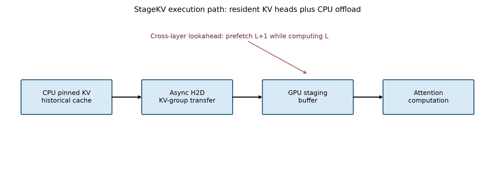

# Experimental Setup

## Hardware and Models

实验运行在单张 NVIDIA GeForce RTX 4090 上。测试模型为：

| Model               | Layers | Query Heads | KV Heads | Head Dim | Resident Heads |
| ------------------- | -----: | ----------: | -------: | -------: | -------------: |
| Qwen2.5-7B-Instruct |     28 |          28 |        4 |      128 |            r=2 |
| Qwen2.5-3B-Instruct |     36 |          16 |        2 |      128 |            r=1 |

两种配置均将 50% 的 KV heads 持久保留在 GPU，其余历史 K/V 位于 CPU pinned memory。

## Compared Methods

1. Standard：Transformers GPU DynamicCache。
2. Bidirectional：异步 H2D 读取与异步 D2H 追加。
3. Cross-layer：在 Bidirectional 基础上，在计算第 L 层时预取第 L+1 层历史 KV。

## Protocol

- Context length：8192 tokens
- Generated tokens：32
- Warmup：2 次
- Measured repetitions：5 次
- Decode：确定性 greedy decoding
- 固定随机种子
- 三种方法轮换执行顺序
- 每 token 使用 compute-stream CUDA event 计时
- 每个 trial 结束后执行完整 CUDA synchronization

## Metrics and Gates

报告 steady decode CUDA latency、标准差、持久 GPU/CPU KV、H2D/D2H GiB 和执行顺序方差。正确性门禁包括生成序列、逐步 Top-1、cache ratio、blocking D2H 以及跨层调度计数。

Transfer profile 使用 1 warmup + 1 measured，仅用于机制分析，不作为正式性能证据。


```

```

```

```


# Experimental Setup

## Hardware and Models

实验运行在单张 NVIDIA GeForce RTX 4090 上。本文使用 Qwen2.5-7B-Instruct 和 Qwen2.5-3B-Instruct 两个模型。两者均采用 Grouped-Query Attention，但层数、Query Head 数量和 KV Head 数量不同。

| Model               | Layers | Query Heads | KV Heads | Head Dim | Resident KV Heads |
| ------------------- | -----: | ----------: | -------: | -------: | ----------------: |
| Qwen2.5-7B-Instruct |     28 |          28 |        4 |      128 |                 2 |
| Qwen2.5-3B-Instruct |     36 |          16 |        2 |      128 |                 1 |

在两种模型中，StageKV 将一半 KV heads 持久保留在 GPU，其余历史 K/V 状态存储在 CPU pinned memory 中。因此，本文讨论的是持久 GPU KV Cache 的缩减，而不是整个进程 GPU 显存占用的等比例缩减。



## Compared Methods

本文比较三种方法：

1. **Standard**：使用 Transformers GPU DynamicCache，全部历史 KV 保留在 GPU。
2. **Bidirectional**：使用 resident KV heads，并将非驻留历史 KV 在需要时异步 H2D 搬运，同时使用异步 D2H 追加新产生的 KV。
3. **Cross-layer**：在 Bidirectional 的基础上，在计算第 L 层时预取第 L+1 层的历史 KV。

## Experimental Protocol

正式实验设置如下：

- Context length：8192 tokens；
- Generated tokens：32；
- Warmup：2 次；
- Measured repetitions：5 次；
- Decoding：确定性的 greedy decoding；
- 固定随机种子；
- 三种方法轮换执行顺序；
- 使用 compute-stream CUDA event 测量稳态 decode latency；
- 每个 trial 结束后执行 CUDA synchronization。

所有方法使用相同的输入、模型权重、上下文长度、输出长度和随机种子。

## Metrics

本文报告以下指标：

- steady decode latency，单位为 ms/token；
- 均值、样本标准差和变异系数；
- persistent GPU KV Cache 和 CPU KV Cache；
- H2D/D2H 数据量；
- 生成序列和逐步 Top-1 一致性；
- cache placement；
- 非阻塞 D2H 计数；
- 跨层预取命中、等待和调度计数。

Transfer profile 仅使用 1 次 warmup 和 1 次 measured run，目的是解释传输机制，不能作为正式性能结论。