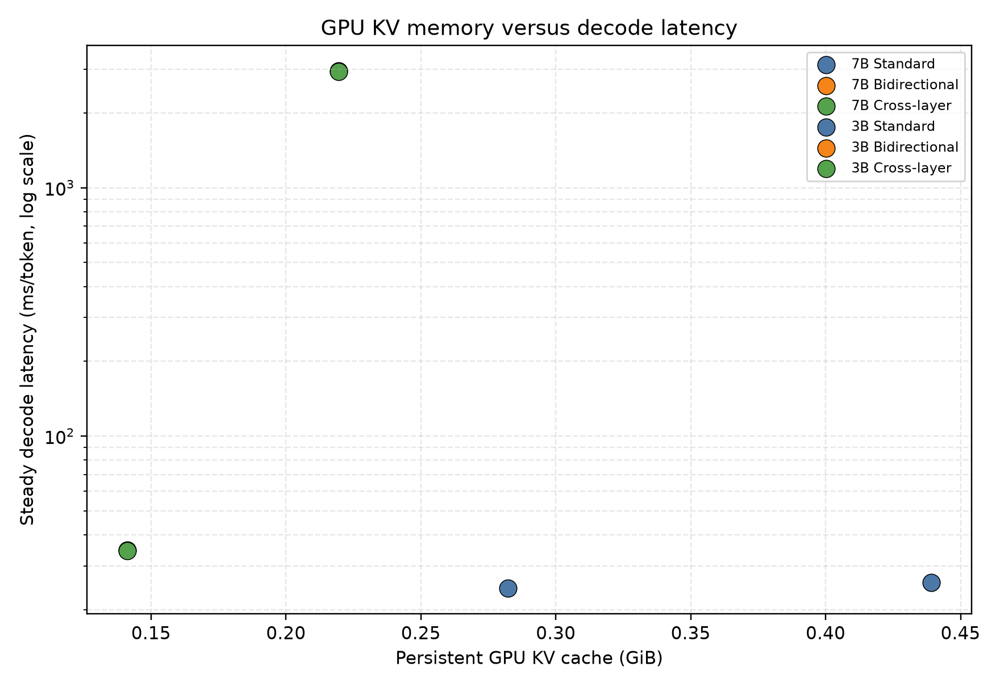

# Experimental Results

## Formal Results

| Model | Method            | CUDA ms/token |     Std | GPU KV GiB | CPU KV GiB |
| ----- | ----------------- | ------------: | ------: | ---------: | ---------: |
| 7B    | Standard          |        25.751 |   0.231 |   0.439156 |          0 |
| 7B    | Bidirectional r=2 |      2943.486 | 564.009 |   0.219578 |   0.219578 |
| 7B    | Cross-layer r=2   |      2930.545 | 432.424 |   0.219578 |   0.219578 |
| 3B    | Standard          |        24.405 |   0.168 |   0.282314 |          0 |
| 3B    | Bidirectional r=1 |        34.596 |   0.075 |   0.141157 |   0.141157 |
| 3B    | Cross-layer r=1   |        34.470 |   0.232 |   0.141157 |   0.141157 |

## Correctness and Memory

所有正式 trial 均通过生成序列、Top-1、cache ratio、非阻塞 D2H 和跨层调度门禁。7B 的持久 GPU KV 从 0.439156 GiB 降至 0.219578 GiB；3B 从 0.282314 GiB 降至 0.141157 GiB，均约降低 50%。

## Latency Tradeoff

3B Cross-layer 的稳态延迟比 Standard 高约 41.2%。7B Cross-layer 约为 Standard 的 114 倍，并伴随较大的 trial/order 方差。因此，显存节省并非没有代价，且 7B 结果显示 PCIe 或同步开销可能成为严重瓶颈。

## Cross-Layer Evaluation

7B 的 Cross/Bidirectional speed ratio 为 1.004416x，3B 为 1.003662x，均低于预设的 1.05x。跨层方法与双向方法的传输字节量相同，说明当前 lookahead 调度改变了搬运顺序，但没有降低数据移动量。

## Transfer Profile

单次 profiling 中，7B Cross-layer 的 H2D 和 D2H event totals 高于 Bidirectional；3B 两种方法的传输事件时间接近。这些结果只能用于解释机制，不构成正式性能结论。

## Conclusion

实验支持“正确性保持的 50% 持久 GPU KV 节省”结论，但不支持“跨层预取稳定加速”结论。StageKV 应被报告为显存—延迟权衡方案。

# Experimental Results

## Correctness and Memory Reduction

所有正式 trial 均通过生成序列、逐步 Top-1、cache placement、非阻塞 D2H 和跨层调度门禁。这里的正确性指行为级一致性，不将结果表述为所有 logits 逐位相等。

在 Qwen2.5-7B-Instruct 上，Standard 的 persistent GPU KV Cache 为 0.439156 GiB，StageKV 为 0.219578 GiB，减少 50%。

在 Qwen2.5-3B-Instruct 上，Standard 的 persistent GPU KV Cache 为 0.282314 GiB，StageKV 为 0.141157 GiB，同样减少 50%。

该结果支持以下结论：

> Resident KV-head offloading 可以在保持行为级正确性的情况下，将持久 GPU KV Cache 减少约 50%。

需要强调，50% 指 persistent GPU KV Cache，不代表整个模型进程的 GPU 显存都减少 50%。



## Latency Tradeoff

正式实验结果如下：

| Model | Method | Steady CUDA ms/token | Std | GPU KV GiB | CPU KV GiB |
|---|---|---:|---:|---:|---:|
| Qwen2.5-7B | Standard | 25.751 | 0.231 | 0.439156 | 0 |
| Qwen2.5-7B | Bidirectional | 2943.486 | 564.009 | 0.219578 | 0.219578 |
| Qwen2.5-7B | Cross-layer | 2930.545 | 432.424 | 0.219578 | 0.219578 |
| Qwen2.5-3B | Standard | 24.405 | 0.168 | 0.282314 | 0 |
| Qwen2.5-3B | Bidirectional | 34.596 | 0.075 | 0.141157 | 0.141157 |
| Qwen2.5-3B | Cross-layer | 34.470 | 0.232 | 0.141157 | 0.141157 |

相对于 Standard：

- 7B Cross-layer 的延迟约为 Standard 的 113.80 倍；
- 3B Cross-layer 的延迟约为 Standard 的 1.41 倍。

因此，StageKV 在当前实验条件下表现为显存—延迟权衡方案，而不是无代价的显存优化。

7B 的 Cross-layer 结果还具有较大的 trial 间波动。其 5 次 paired difference 的平均值为 12.94 ms/token，95% 置信区间为 [-1041.20, 1067.09]。这说明 Cross-layer 相对于 Bidirectional 的优势并不稳定。

3B 的平均 paired difference 为 0.126 ms/token，95% 置信区间为 [-0.119, 0.372]，同样不能据此宣称统计显著的加速。

## Cross-Layer Prefetch Evaluation

Cross-layer 与 Bidirectional 的正式延迟比定义为：

```text
Bidirectional latency / Cross-layer latency